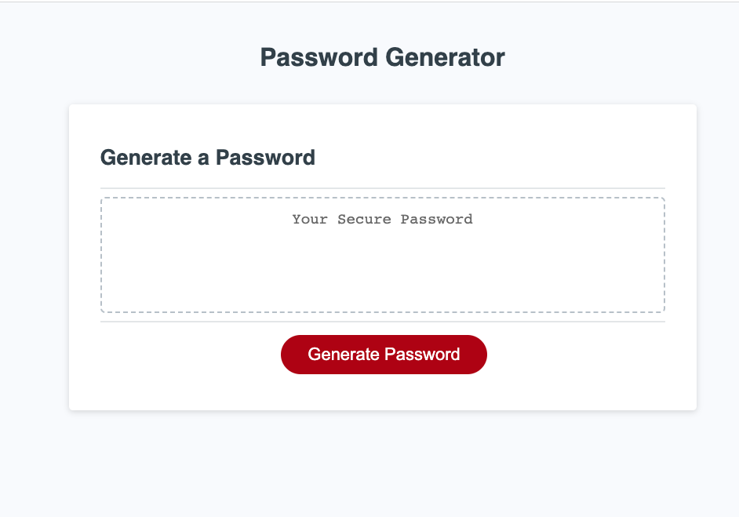

# Password Generator Challenge, Module 3

Password Generator

## Description
This is a bootcamp design challenge that has provided starter and example code from which I based this code to create a Password Generator. The user story prompted the creation of password generator to improve security for employees working with sensitive data. The criteria of the project included creating a password generator box that prompts user to identify their requested length of password. Code will ensure they selected a value greater than 8 and less than 128. It will also give the prompt for selection of one or more of: special characters, numbers, upper or lowercase letters. When a user selects options the code will assess input around parameters and generate random password. 

## Mockup

## Installation
N/a

## Usage
To practice generating JavaScript code, including arrays, functions, objects, conditional statements etc. 

## Credits

N/A

## License 

Please refer to the Licesnse in the repo. 